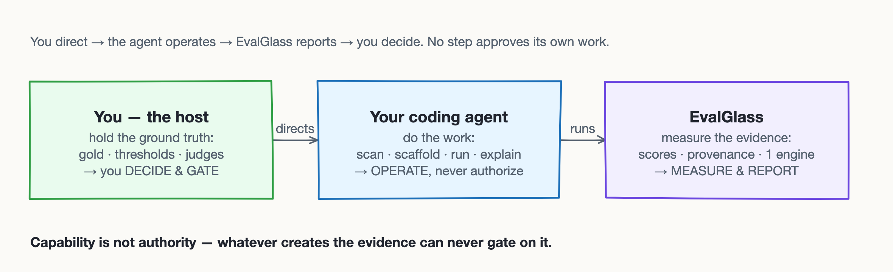
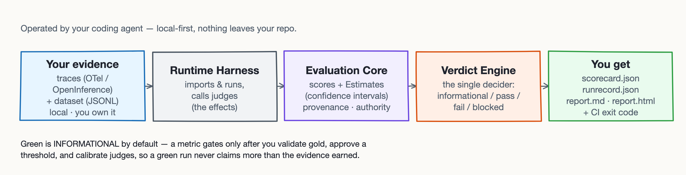

<div align="center">


#  EvalGlass

**Evaluation discipline for agentic apps — without becoming an eval team.**<br>
Honest, local-first scorecards you operate through your coding agent.

[](./LICENSE)
[](https://github.com/EvalGlass/evalglass-core/actions/workflows/ci.yml)
[](https://code.claude.com/docs/en/plugins)
[](https://evalglass.com)


<sub>Pre-alpha `v0.2.1`</sub>

</div>

You're shipping AI faster than you can check it. **EvalGlass is AI quality control for agentic apps,
operated through your coding agent** — a small, **vendored, local-first framework** (plain files in
your repo, nothing to host). Point it at your app and it stands up a real evaluation: project-specific
checks, readable **scorecards**, and a CI gate you can defend, all from evidence **you** own. You
direct the agent; it does the work; a single **Verdict Engine** decides. *It measures and reports;
you decide and gate.*

> **Get started:** [install the plugin](#install), then tell your Claude or Codex agent —
> *"Evaluate my agentic app with EvalGlass."*

**Local-first, repo-owned, honest by construction.** Learn more at
[**evalglass.com**](https://evalglass.com) — [Docs](https://evalglass.com/docs) ·
[Learn](https://evalglass.com/learn) · [Use cases](https://evalglass.com/use-cases).

<p align="center">
  
</p>

## Why EvalGlass

The block was never belief — you already know evaluation matters. It's the **effort**: datasets,
rubrics, labels, judge calibration, baselines, CI. Done right, it can feel like standing up an eval
team you never wanted to become. EvalGlass removes the effort, not the rigor: your coding agent does
the setup (scan the call sites, import the traces, scaffold the checks, wire CI), so you keep the
**authority** to decide what ships.

It answers the questions you actually have:

- You swapped the model to cut cost — did quality hold, or did you just lose the customer?
- The new prompt looked sharper in the demo — did it improve the product, or only the demo?
- The workflow feels off this week — real drift, or nerves?

Most eval setups risk a green check that means less than it looks like. EvalGlass keeps the result
**legible and bounded**: every score carries its status, validity, and provenance, and metrics gate
only after *you* validate gold, approve a threshold, and calibrate judges. The plugin can never make
a run pass; you decide what gates.

## Requirements

- **Python 3.12+** (the vendored runtime is standard-library-only; its one optional dependency is
  PyYAML for config).
- **Claude Code or Codex** (recent version) to operate the plugin. The underlying runtime also works
  as a plain CLI with no agent — see [Migrating from the direct CLI](#migrating-from-the-direct-cli).

## Install

In **Claude Code**:

```text
/plugin marketplace add EvalGlass/evalglass-core
/plugin install evalglass-core@evalglass
```

Prefer not to use the marketplace? Clone the repo and point Claude Code at it
(`claude --plugin-dir .`). **Do not** pipe an installer into your shell (`curl … | sh`): a tool
whose whole value is auditability should never ask you to run un-reviewed code. Everything here is
plain files you can read.

**Two runtimes, one source.** EvalGlass runs on **Claude Code and Codex** from the *same* repo and
the *same* canonical `skills/` tree — no forked guidance. For Codex, [`AGENTS.md`](./AGENTS.md) is the
entry point and `scripts/sync-to-codex-plugin.sh` produces the Codex marketplace copy; the vendored
`evals/_evalglass/` runtime is identical whichever runtime installed it and keeps working after the
plugin is removed. (A public Codex marketplace listing is a maintainer step.)

## Quick start (the first-run journey)

See it work in one command, then wire it into your own repo. In seconds you have a real (honest,
`informational`) Scorecard — no dataset, no keys, no setup:

```text
1.  /evalglass run --example quickstart   # the bundled demo — no install needed
        → a populated Scorecard + an honest INFORMATIONAL verdict, with a diagnostic

2.  /evalglass setup       # in your repo: discover candidate LLM call sites (read-only,
                           # consent-gated), vendor the runtime, scaffold proposed assets + CI
3.  /evalglass connect     # import your Langfuse/Phoenix/LangSmith trace exports (OTel/OpenInference) — live pull is opt-in
4.  /evalglass run         # produce your own Scorecard (the vendored runtime)
5.  /evalglass view        # per-metric status & values
6.  /evalglass explain     # why each number is — or isn't — trustworthy
```

Day one is two verbs: **`/evalglass run --example quickstart`** (see it work) and
**`/evalglass setup`** (wire it into your repo). Or just say *"evaluate my agentic app with
EvalGlass"* and the agent routes to the right step. To go further, tell the agent **which checks
your app needs** and it authors them for you — see
[Authoring metrics](#authoring-metrics-you-tell-the-agent-what-to-check).

## Commands vs. skills

Say what you want and the matching **skill** triggers automatically; the **`/evalglass <verb>`**
commands are the explicit shortcut for the same acts. The work — scanning, vendoring, wiring CI,
running — is always explicit and user-invoked. Only the *narration* of results is automatic, and an
always-on guardrail keeps that wording from overclaiming.

## The `/evalglass` verbs

| Verb | What it does |
|---|---|
| `/evalglass` | Honest status overview (what's integrated, your data/metric/authority state, the next step). Runs nothing. |
| `/evalglass setup` | Discover candidate LLM call sites, vendor the runtime, scaffold a `proposed` dataset + metrics + CI. Flags: `--scan-only`, `--dry-run`, `--ci`, `--upgrade`. |
| `/evalglass connect` | Import exported OTel/OpenInference trace JSON (no SDK, no network), or scaffold a `proposed` dataset. Those traces come from your tracing tool — Langfuse, Phoenix, or LangSmith — which `connect --live` can also pull directly (opt-in, experimental). |
| `/evalglass run` | Run the evaluation via the vendored runtime; read back the verdict. |
| `/evalglass view` | Per-metric status, validity, and values from the Scorecard. |
| `/evalglass explain` | Narrate *why* a number is or isn't trustworthy, from typed diagnostics & authority. |
| `/evalglass compare` | Compare against a baseline — a delta only when the runs are comparable. |
| `/evalglass baseline` | Promote a baseline (a deliberate, explicit act). |
| `/evalglass ci` | Copy the CI workflow that runs the vendored runtime (alias of `setup --ci`). |

**Authoring & advanced** (opt-in, never authoritative):

- `add-metric` scaffolds a `proposed` metric. `add-judge` + `calibrate` scaffold an
  **uncalibrated** judge that can't gate until you calibrate it. A custom scorer goes through
  `writing-a-host-evaluator`.
- Turning a metric into a gate is **host-owned** and has no verb — `promoting-a-gate` is guidance.
- `connect --live <platform>` is a wired, **opt-in** verb (Langfuse / Phoenix / LangSmith): it
  scaffolds a deletable lane, ships no provider SDK, and its live pull is `proposed` data that can't
  gate. `connect --synth` is governance-only (no generator).
- Per-source-function views are an **unbuilt** advanced extension.

**Authoring metrics** — you decide what to measure and the agent scaffolds it — has its own section:
[Authoring metrics](#authoring-metrics-you-tell-the-agent-what-to-check).

**More runtime capabilities:**

- **Grade whole runs.** A `traces:` route can set `unit: trajectory` (or `session`/`step`) to grade
  the whole agent run, not one call at a time. An aggregate's egress is the *worst of its members*,
  and running over proposed data it stays informational.
- **Cluster the failures.** The Scorecard groups a metric's failing items by their diagnostic
  **code** — turning "faithfulness = 0.82" into "the 18% that failed are all missing-citation
  cases." Clusters are recomputed from the saved scores on load, so a hand-edited one fails closed.
- **Watch for drift.** The `watch` subcommand runs on a schedule (cron/CI, not a daemon): one run,
  compared to the baseline, written to `drift.json`. It flags a `regression` only when the runs are
  *comparable* and the paired interval clears zero; otherwise it reports `not_comparable` or
  `missing_baseline` plainly — never "no regression." It changes no exit code and never promotes the
  baseline.

## Authoring metrics: you tell the agent what to check

EvalGlass is the **framework, not the oracle** — it supplies the evaluation machinery and lets *you*
decide what to measure. You know your app and how it fails; tell the agent the check you want ("flag
any answer that cites a source not in the retrieved context", "the summary must stay under 40 words",
"the `status` field must be one of these five values") and the **`authoring-a-metric`** skill
scaffolds it into your `evals/evalglass.yaml` as a **`proposed`**, informational metric. Nothing it
writes can gate until *you* validate the gold, approve a threshold, and (for judges) calibrate.

You have three tiers to reach for, cheapest-honest first:

- **Runtime (deterministic, no gold):** point a built-in at your output — `structural_shape`,
  `field_presence`, `numeric_bounds`, `enum_membership`, `word_count_bounds`, `trajectory_shape`.
  These give **real signal with no dataset and no calibration**, so your first run isn't empty. They
  are honestly a **structural floor** — they catch a malformed output, never prove quality.
- **Reference (needs host-validated gold):** `exact_match`, `set_overlap`, or a custom scorer over a
  dataset you validate.
- **Judge (needs calibration):** an LLM-graded metric with a host-owned rubric that stays
  **uncalibrated** — and cannot gate — until you run an agreement study (`calibrating-a-judge`). Opt
  into live judge scoring through a generic optional lane (`openai-judge` for an OpenAI-compatible
  endpoint) with **host-injected rubrics** — EvalGlass ships the transport, you own the domain content.

For a scorer the built-ins can't express, `writing-a-host-evaluator` scaffolds a host-owned
`evaluate(example, context, evidence)` that imports only the vendored contracts. The framework gives
you the vocabulary and the seams; the domain judgment stays yours.

## What lands in your repo

`setup` scaffolds one `evals/` tree — plain files you own, beside a vendored runtime you can read and
delete:

```text
evals/
├─ _evalglass/          # managed runtime (vendored) — re-vendoring only replaces this
│    core/ · harness/ · adapters/ · vendor-manifest.json
├─ evalglass.yaml       # your config: routes, metrics, thresholds, gates
├─ evalglass.lock
├─ datasets/*.jsonl     # host-owned: the gold you validate
├─ traces/*.jsonl       # imported trace evidence
├─ evaluators/*.py      # host-owned: your scorers (import the vendored runtime)
├─ rubrics/*.md         # host-owned: judge rubrics
├─ calibration/*.json   # judge agreement studies
├─ baselines/*.json     # baselines you promote
├─ reports/             # scorecard.json · runrecord.json · report.md · report.html
└─ tests/
```

Everything under `_evalglass/` is **managed** — a re-vendor replaces only those files. Everything
else is **host-owned**: the gold, rubrics, thresholds, calibration, and evaluators are yours to
validate, and scaffolded assets stay `proposed`/`uncalibrated` until you do. The runtime needs no
plugin and no agent — `PYTHONPATH=evals python -m _evalglass.harness.cli run` is enough.

## What a green run looks like

<p align="center">
  
</p>

The bundled quickstart, run as-is, produces real signal and an honest verdict:

```text
verdict: informational (no active gate — this run does not assert pass/fail quality) [exit zero]
  - exact_match:      value=1  included=3  authority=informational
  - structural_shape: value=1  included=5  authority=informational
  - field_presence:   value=1  included=5  authority=informational
  - answer_nonempty:  value=1  included=5  authority=informational
```

The machine artifacts are primary: `scorecard.json` (the compact, authority-aware summary),
`runrecord.json` (the complete record), and `report.md` (a rendering of the Scorecard). The
deterministic non-reference metrics (`structural_shape`, `field_presence`) give you **real signal
with no gold and no calibration** — which is why the run is useful immediately, and why it is
honestly labelled `informational` rather than "passing."

Each metric also carries an **`Estimate`**: the point value, a **confidence interval** (Wilson for
proportions, Student-t for means), and the effective *n*. By default a gate decides on the **lower
confidence bound**, not the point — so a few lucky observations can't clear the bar (three-of-three
is evidence, not proof). The `report.html` dashboard renders these interval bands; like `report.md`,
it adds no authority.

## What a green run does **not** mean

A non-failing EvalGlass run is **evidence, not proof.** `informational` means *no metric was
authorized to gate* — not that quality was verified. Specifically, a green/informational run does
**not** mean:

- the outputs are correct (reference metrics need host-validated gold);
- a judge's opinion can be believed (judges need calibration first);
- there is no regression (a delta is only meaningful against a *comparable* baseline);
- every LLM call was covered (`setup`'s scan finds **candidate** call sites, not necessarily all);
- the system is safe.

A metric that is `blocked`, `non_evaluable`, or `skipped` carries **no value** — it is never shown
as `0.0`. The explicit gap is the point.

## Core executes — what it is, and what it isn't

EvalGlass Core is the open, host-directed evaluation runtime: **you tell it what to evaluate, and it
executes honestly.** It gives your team a rigorous system to *define, run, compare, and retain*
evaluations — metrics, judges, datasets, traces, CI, reports, baselines, and longitudinal evidence —
over checks **you** own. It never inspects your application to decide, on its own, what you ought to
test.

That boundary is deliberate. Deriving *what* to measure from an application — reading its traces,
prompts, and schemas to propose a bespoke suite — is **metric discovery**, and it lives in the
separate `evalglass-discovery` repo, not here. In
short: **Core executes · Discovery finds · Intelligence explains.** Core is the substrate the others
build on; nothing in it decides your evaluation agenda for you.

## Compared to other eval tools

EvalGlass optimizes a different axis than promptfoo, DeepEval, Ragas, or MLflow: **local-first, a
single Verdict Engine, typed authority, and a green that means exactly what the evidence supports.**
It runs entirely in your environment (no hosted service, no telemetry), refuses to gate on
unvalidated gold or uncalibrated judges, and ships as an agent-operated plugin. If you want a
defensible CI gate, that's the niche it serves.

## Migrating from the direct CLI

The plugin is an **additive convenience layer.** If you already vendored EvalGlass with
`python -m evalglass.installer install --root .`, you need do nothing — that path is unchanged and still
supported, and the plugin recognizes and coexists with an existing `evals/_evalglass/`. Host
evaluation still runs the vendored runtime:

```bash
PYTHONPATH=evals python -m _evalglass.harness.cli run --config evals/evalglass.yaml
```

## Uninstall / disable

Removing the **plugin** (`/plugin` UI, or deleting the local checkout) is safe and **changes no
verdict** — that is the deletion-invariant, and it is a feature: the vendored runtime under
`evals/_evalglass/` and your CI keep working without the plugin or any agent. Removing the **vendored
runtime** is a separate, deliberate host action: delete `evals/_evalglass/` (and the CI workflow you
copied) if you want to back EvalGlass out of a repo entirely. The plugin is never required at
runtime.

## Troubleshooting

- **`/evalglass` verbs not found** — confirm the plugin installed (`/plugin`), then restart the
  session. Validate the manifest with `claude plugin validate . --strict` from a checkout.
- **A metric shows `blocked`** — that is honest, not a bug: it usually means the dataset is
  `proposed` (not validated gold) or a judge is uncalibrated. Run `/evalglass explain` for the
  typed reason.
- **CI doesn't fail on a regression** — by design, CI is informational until you approve a gate;
  see the scaffolded `evals/README.md` checklist.

## Architecture & contributing

EvalGlass is a small, vendored framework with an effect-free Evaluation Core, a single Verdict
Engine, and an effectful Runtime Harness behind ports. User-facing docs live at
**[evalglass.com/docs](https://evalglass.com/docs)**. To work on the framework itself, start here:

- [`docs/architecture.md`](./docs/architecture.md) — the framework architecture and build contract.
- [`adrs/`](./adrs/) — architecture decision records (plugin packaging is [ADR 0022](./adrs/0022-plugin-packaging-and-delivery.md); Codex second runtime is [ADR 0023](./adrs/0023-codex-second-runtime-packaging.md)).
- [`CONTRIBUTING.md`](./CONTRIBUTING.md) and [`CLAUDE.md`](./CLAUDE.md) — the per-slice workflow and operating guide.

## License & citation

[Apache License 2.0](./LICENSE). If you use EvalGlass in your work, please cite it — see
[`CITATION.cff`](./CITATION.cff).

---

Built by [Syntelesis Lab](https://github.com/Syntelesis-Lab).
