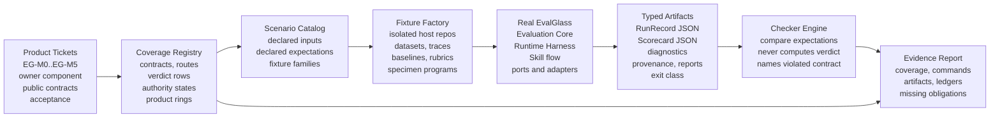

# EvalGlass Testing System Architecture Build Contract

**Status:** testing-system build contract  
**Date:** 2026-05-27  
**Scope:** EGTS M0-M5, aligned to the streamlined EvalGlass product architecture  
**Source:** `EvalGlass_Implementation_Architecture.md`,
`EvalGlass_System_Architecture_Build_Contract.md`, and the updated Jira ticket
workbook

This document defines **EGTS**, the EvalGlass Testing System. EGTS is the
executable proof system for EvalGlass. It is separate from the EvalGlass product
architecture, but it is not optional: a serious evaluation framework needs a
serious way to prove that it does not manufacture false confidence.

The testing-system update follows the streamlined product architecture. EGTS
must prove the Evaluation Core, Verdict Engine, Runtime Harness, trace-native
integration, skill adoption flow, judge calibration, and optional extension
boundaries. It must not reintroduce an overbuilt implementation-control plane.

The new shape is evidence-first:

- Product tickets name the build work.
- EGTS maps product contracts to executable scenarios.
- The real EvalGlass product emits typed artifacts.
- Checkers compare declared expectations to those artifacts.
- Coverage reports show what is proven, missing, blocked, or optional.

## Contents

1. [Purpose](#1-purpose)
2. [Non-Negotiables](#2-non-negotiables)
3. [Proof Rings](#3-proof-rings)
4. [System Map](#4-system-map)
5. [Components](#5-components)
6. [Execution Flow](#6-execution-flow)
7. [Scenario Contract](#7-scenario-contract)
8. [Fixture And Isolation Contract](#8-fixture-and-isolation-contract)
9. [Checker Contract](#9-checker-contract)
10. [Negative Controls And Meta-Tests](#10-negative-controls-and-meta-tests)
11. [Milestone Proof Suites](#11-milestone-proof-suites)
12. [Required And Optional Test Tiers](#12-required-and-optional-test-tiers)
13. [Repository Layout](#13-repository-layout)
14. [Command Surface](#14-command-surface)
15. [Jira And Coverage Contract](#15-jira-and-coverage-contract)
16. [Acceptance](#16-acceptance)

## 1. Purpose

EGTS exists to answer one question:

```text
Can EvalGlass produce a green, passing, or non-failing result that a maintainer
could misread as more authoritative than the evidence permits?
```

If yes, either EvalGlass or EGTS is incomplete.

EGTS does not certify the host application. It certifies that EvalGlass itself
keeps its promises: effect-free core, one Verdict Engine, trace-native but
vendor-neutral input, typed evidence, honest authority, comparable baselines,
host-owned truth, safe vendoring, and extension boundaries.

| Proof type | Meaning | Required result |
|---|---|---|
| Contract proof | Public contracts exist and serialize as documented. | `TraceEnvelope`, `EvalUnit`, `Example`, `EvidenceBundle`, `MetricSpec`, `Score`, `RunRecord`, `Scorecard`, and verdict payloads are exercised by real product code. |
| Route proof | Inputs travel through the intended route. | Dataset, trace, subprocess, skill, judge, baseline, and optional-lane paths do not bypass their public ports. |
| Trust proof | EvalGlass refuses unsupported claims. | Informational, pass, fail, blocked, proposed, approved, calibrated, drifted, comparable, and non-comparable states are proven from typed artifacts. |
| Integration proof | Adapters attach without changing meaning. | Trace backends, `ScoreSink` lanes, live judge lanes, and richer units stay optional and deletable. |
| Evidence proof | Test output is reviewable without conversation memory. | Each scenario leaves Scorecard, RunRecord, diagnostics, provenance, command result, fixture ID, and coverage tags. |

## 2. Non-Negotiables

1. **Real product path.** Required tests drive real EvalGlass public contracts.
   Test doubles are allowed only at effectful edges such as fake judge evidence,
   fixture host commands, and optional adapter stand-ins.
2. **No duplicate Verdict Engine.** EGTS may declare an expected verdict and
   compare it to the real product verdict. It must not compute the verdict from
   authority fields, thresholds, metrics, policy, or baselines.
3. **Typed artifacts first.** `Scorecard` JSON and `RunRecord` JSON are the
   primary assertion surface. Markdown and terminal output are secondary
   readability checks.
4. **Required tier is hermetic.** Required tests run without network,
   credentials, live models, hosted trace backends, Docker, background daemons,
   vector stores, or optional lanes.
5. **Route fidelity.** A route test must use the route under proof. Trace-route
   scenarios may not construct final `Example` objects directly. Skill tests may
   not pretend the skill ran by copying final files manually.
6. **State isolation.** Runtime scenarios get fresh workspaces, datasets,
   traces, reports, result stores, baselines, calibration files, ledgers, and
   environment variables.
7. **Negative controls are mandatory.** The system must include seeded-bad
   products, malformed artifacts, and broken fixtures that prove checkers fail
   for the right reason.
8. **Optional lanes are removable.** Removing all optional lanes must leave the
   required suite green.
9. **Coverage is explicit.** Public contracts, product tickets, product rings,
   verdict rows, authority states, routes, and optional lanes map to scenario
   IDs. Missing coverage is a first-class result.

## 3. Proof Rings

The updated testing system uses proof rings that mirror the streamlined product
rings. Rings keep the proof system strict without turning it into an execution
platform.

| Proof ring | Owns | Must not own |
|---|---|---|
| Contract Proof | Schema snapshots, public contract serialization, evaluator protocol fixtures, score-state fixtures, verdict-row fixtures. | Product semantics or alternate score aggregation. |
| Route Proof | Dataset, trace, subprocess, judge, baseline, skill, and optional-lane scenario paths. | Bypassing the route under proof. |
| Trust Proof | Authority, data policy, threshold approval, judge calibration, baseline comparability, report overclaim checks. | Human approval or domain truth. |
| Integration Proof | OpenTelemetry/OpenInference conformance, trace backend adapters, `ScoreSink` lanes, optional live judge lanes, richer `EvalUnit` lanes. | Required-tier dependency on hosted services or provider SDKs. |
| Evidence Governance | Coverage registry, proof planner, evidence reports, negative controls, deletion verification. | Product verdicts, product authority, or broad workflow orchestration. |

## 4. System Map

EGTS wraps EvalGlass from the outside. It creates fixtures, runs real product
entrypoints, reads typed artifacts, and reports proof coverage. The proof
planner selects obligations from static metadata; it is not a product runtime
and not a second approval system.



## 5. Components

| Component | Owns | Must not own | Primary output |
|---|---|---|---|
| Scenario Catalog | Declarative scenario files with target ticket, public contract, route, fixtures, expected artifact state, and coverage tags. | Hidden expectations in checker code. | Validated scenario definitions. |
| Coverage Registry | Mapping from product tickets and architecture promises to required scenario IDs. | Inferring product verdicts or product authority. | Coverage report and missing-obligation list. |
| Proof Planner | Static selection of suites for a product ticket, milestone, changed contract, or optional lane. | Ad hoc implementation control, product approval, or weakening required obligations. | Deterministic command plan and required evidence list. |
| Fixture Factory | Datasets, traces, baselines, rubrics, calibration records, host repos, fake judge evidence, specimen programs, and adapter stubs. | Constructing final core objects when a route is under test. | Hermetic scenario workspace. |
| Scenario Runner | Invoking real core runner, CLI, skill installer, or optional-lane command. | Replacing normalization, aggregation, authority, verdict, or exit-code mapping. | Command result, stdout/stderr, exit class, and artifact paths. |
| Artifact Collector | Collecting `RunRecord`, `Scorecard`, reports, ledgers, file diffs, manifests, locks, and optional adapter outputs. | Interpreting product quality. | Scenario evidence bundle. |
| Checker Engine | Comparing declared expectations against typed product outputs. | Calculating the expected verdict or silently repairing artifacts. | Check result with violated contract names. |
| Negative-Control Suite | Seeded-bad fixtures, mutated product artifacts, broken route objects, and intentionally overclaiming reports. | Replacing normal scenarios. | Proof that checkers catch false positives. |
| Evidence Reporter | Human-readable and machine-readable proof summaries. | Treating evidence as product authority. | Coverage, command, artifact, and blocker report. |

## 6. Execution Flow

All proof runs follow one path. This makes failures explainable and keeps the
testing system from growing hidden execution modes.

```mermaid
flowchart LR
  Target["Proof Target<br/>ticket, milestone<br/>contract, lane"]
  Plan["Plan Obligations<br/>coverage registry<br/>required suites"]
  Materialize["Materialize Fixtures<br/>fresh workspace<br/>host-owned truth<br/>managed runtime"]
  Run["Run Real EvalGlass<br/>core, CLI, skill<br/>or lane command"]
  Collect["Collect Artifacts<br/>RunRecord, Scorecard<br/>report, exit, ledgers"]
  Check["Check Expectations<br/>typed JSON first<br/>report wording second"]
  Neg["Run Negative Controls<br/>seeded bad cases<br/>checker sanity"]
  Report["Emit Evidence<br/>coverage, missing proof<br/>blocked items"]

  Target --> Plan
  Plan --> Materialize
  Materialize --> Run
  Run --> Collect
  Collect --> Check
  Check --> Neg
  Neg --> Report
```



Execution rules:

- A scenario cannot pass if its expected verdict, exit class, authority claim,
  route, provenance, or artifact obligations are unspecified.
- Product failures and test-system failures are separated in the evidence
  report.
- If a product run cannot produce typed artifacts, the scenario is blocked or
  failed according to the scenario contract; it is never counted as a successful
  quality proof.
- Evidence reports are append-only for a run. A later retry creates a new run
  record instead of overwriting the earlier proof.

## 7. Scenario Contract

Scenarios are declarative. They state what public contract is being proved and
what honest product output is expected. Checker code may not contain hidden
business rules that should have been scenario data.

| Scenario field | Required meaning |
|---|---|
| `id` | Stable ID, for example `m1.trace.local_jsonl.valid_call`. |
| `product_ticket` | Product ticket or epic key from the Jira workbook, for example `EG-M1-3`. |
| `milestone` | `M0`, `M1`, `M2`, `M3`, `M4`, or `M5`. |
| `product_ring` | Evaluation Spine, Trust Layer, Integration Layer, or Adoption Layer. |
| `public_contract` | Named contract, port, artifact, verdict row, host-layout rule, or optional-lane boundary. |
| `input_route` | Core in-memory, dataset JSONL, trace JSONL, open-convention trace, subprocess replay, skill install, fake judge, baseline, score sink, backend adapter, or richer unit. |
| `fixtures` | Dataset, trace, baseline, calibration, rubric, specimen, config, host repo, adapter stub, and expected file mutations. |
| `expect.verdict` | Expected EvalGlass verdict for verdict scenarios. This is declared, not computed. |
| `expect.exit_class` | `zero`, `nonzero_fail`, `nonzero_blocked`, or `infrastructure_error`. |
| `expect.authority` | Expected authority claim: no active gate, active gate, proposed data, approved threshold, uncalibrated judge, calibrated judge, drifted judge, policy block, comparable baseline, or non-comparable baseline. |
| `expect.artifacts` | Required `RunRecord`, `Scorecard`, report, ledger, manifest, lock, diff, or sink output. |
| `expect.provenance` | Required fingerprint dimensions or comparability result. |
| `coverage_tags` | Public contract tags, product ticket tags, verdict rows, routes, authority states, and optional-lane tags. |

Minimal scenario example:

```yaml
id: m1.trace.local_jsonl.valid_call
product_ticket: EG-M1-3
milestone: M1
product_ring: Integration Layer
public_contract: TraceSource -> TraceEnvelope -> EvalUnit -> Example
input_route: trace_jsonl
fixtures:
  trace: traces/local_valid_call.jsonl
  config: configs/informational_trace.yaml
expect:
  verdict: informational
  exit_class: zero
  authority: no_active_gate
  artifacts:
    scorecard: required
    runrecord: required
  provenance:
    trace_source: local_jsonl
coverage_tags:
  - contract.TraceEnvelope
  - contract.EvalUnit
  - route.trace_jsonl
  - ticket.EG-M1-3
```

## 8. Fixture And Isolation Contract

Fixtures must prove the same paths users will rely on. They are not shortcuts
around the product architecture.

| Fixture family | Proves | Forbidden shortcut |
|---|---|---|
| Core contract fixtures | Public dataclasses, enums, evaluator protocol, score states, aggregation, authority, and verdict rows. | Importing runtime adapters or using filesystem/network effects in core tests. |
| Dataset JSONL fixtures | `DatasetStore`, references, dataset status, malformed records, proposed versus validated truth. | Constructing final `Example` objects when dataset route behavior is under test. |
| Local trace JSONL fixtures | `TraceSource`, trace provenance, malformed traces, data policy, call-level `EvalUnit` selection. | Passing raw trace objects directly to evaluators. |
| Open-convention trace fixtures | OpenTelemetry/OpenInference-shaped spans, messages, tool calls, model metadata, timing, and mapping diagnostics. | Requiring a tracing backend SDK in required tests. |
| Specimen programs | `TaskRunner`, subprocess JSON in/out, timeouts, stderr, malformed output, and infrastructure failure separation. | Calling host code in-process when subprocess replay is under test. |
| Baseline fixtures | `ComparableRunFingerprint`, baseline promotion, changed dimensions, regression gate behavior. | Comparing score numbers without provenance. |
| Skill fixture repos | Discovery, vendoring, `vendor-manifest.json`, `evalglass.lock`, scaffolded host-owned truth, re-vendoring. | Treating copied files as proof that the skill flow ran. |
| Judge fixtures | `JudgeModel`, fake judge evidence, rubrics, parser diagnostics, calibration records, drift, approved thresholds. | Using live model calls in required tests. |
| Optional lane fixtures | Trace backends, `ScoreSink`, live judges, annotation, synthetic data, richer units, deletion checks. | Making optional SDKs required for local proof. |

Isolation rules:

- Each runtime scenario uses a fresh workspace and result directory.
- Environment variables are explicit and scenario-local.
- Required tests block network and credential access.
- Optional lanes declare every external prerequisite and may report skipped when
  prerequisites are absent.
- Generated artifacts are never reused as hidden input to later scenarios unless
  the scenario explicitly declares that dependency.

## 9. Checker Contract

Checkers are assertion tools, not alternate EvalGlass engines.

| Checker | Reads | Asserts | Must not |
|---|---|---|---|
| Contract checker | Public contract modules and serialized examples. | JSON compatibility, stable enums, required fields, invalid state rejection. | Bless undocumented public drift. |
| Scorecard checker | `Scorecard` JSON. | Verdict value, authority explanation, metric summaries, status counts, diagnostics, baseline state. | Compute verdict from metric values. |
| RunRecord checker | `RunRecord` JSON. | Config, examples, metric specs, scores, evidence refs, evaluator versions, provenance. | Ignore missing provenance in trust scenarios. |
| Trace checker | Trace artifacts and run artifacts. | Raw trace -> `TraceEnvelope` -> `EvalUnit` -> `Example` route fidelity. | Accept vendor-shaped data in evaluator-visible fields. |
| Exit checker | Process exit and verdict payload. | Zero for `pass` and `informational`; nonzero for `fail` and `blocked`; separate infrastructure error class. | Add test-only exit rules. |
| Authority checker | Scorecard authority fields. | Proposed, approved, calibrated, drifted, policy, comparable, and non-comparable claims. | Approve data, thresholds, judges, or baselines. |
| Provenance checker | Run fingerprints and baseline records. | Comparable claims have matching dimensions; non-comparable claims explain changed dimensions. | Treat score deltas as regression proof alone. |
| Report checker | Markdown, terminal, and CI annotations. | Human wording does not overclaim authority and references useful diagnostics. | Use prose as the primary truth source. |
| Skill boundary checker | File diffs, manifest, lock, scaffold output. | Managed files and host-owned truth remain separated. | Allow silent host-owned overwrite. |
| Optional lane checker | Lane artifacts, dependency metadata, deletion results. | Lane attaches through ports and can be removed. | Allow optional lane code to change core meaning. |

Checker rule:

```text
Compare declared expectation to real product output.
Never calculate the expected EvalGlass verdict from product internals.
```

## 10. Negative Controls And Meta-Tests

EGTS must prove that the tests themselves are capable of failing. This is
critical because EvalGlass is a trust product: shallow tests are dangerous.

| Negative control | Purpose | Expected EGTS behavior |
|---|---|---|
| Mutated verdict payload | Proves checkers do not ignore verdict fields. | Scorecard checker fails with violated `VerdictPayload` contract. |
| Missing authority reason | Proves reports cannot pass without typed authority. | Authority checker fails before report checker. |
| Blocked score encoded as zero | Proves score status is not collapsed into value. | Score checker fails and aggregation expectation fails. |
| Vendor trace leaked to evaluator | Proves route normalization boundary. | Trace checker fails with route-fidelity violation. |
| Non-comparable baseline treated as regression proof | Proves baseline trust boundary. | Provenance checker fails and verdict expectation fails. |
| Skill overwrites host-owned rubric | Proves vendoring boundary. | Skill boundary checker fails with host-owned mutation. |
| Live judge used in required tier | Proves hermetic required suite. | No-network or dependency checker fails. |
| ScoreSink mutates verdict | Proves sink immutability. | Optional lane checker fails and local Scorecard comparison fails. |

Meta-test rule: every checker family must have at least one seeded-bad fixture
that fails for the intended contract reason. A checker without a negative
control is not trusted for milestone acceptance.

## 11. Milestone Proof Suites

EGTS mirrors the updated product milestones. It does not create paired Jira
epics; it maps product tickets to proof obligations.

| Suite | Product scope proved | Required proof |
|---|---|---|
| **EGTS-M0 Core Proof** | `EG-M0`: public contracts, trace-aware units, evidence model, score model, diagnostics, registry, evaluator protocol, aggregation, provenance, authority, verdict matrix, serialization. | Real core fixtures emit `RunRecord`, `Scorecard`, and verdict payloads for informational, pass, fail, blocked, score-state, validity, and baseline comparability cases. |
| **EGTS-M1 Runtime Proof** | `EG-M1`: CLI/config, local JSONL datasets, local JSONL traces, route convergence, evaluator loading, result persistence, reports. | Local dataset and trace scenarios converge into `Example + EvidenceBundle`; reports render from Scorecard; default runs stay informational without authority. |
| **EGTS-M2 Trust Runtime Proof** | `EG-M2`: subprocess replay, comparable baselines, data policy, CI annotations, exit code mapping, infrastructure error separation. | CI behavior is derived only from real verdict payloads; non-comparable and policy-forbidden claims block or downgrade honestly. |
| **EGTS-M3 Skill Proof** | `EG-M3`: discovery, install plan, vendoring, manifest, lock, host scaffold, first-run checklist, re-vendoring. | Fixture host repos install cleanly; runtime works after skill removal; scaffolded assets are informational; host-owned files survive re-vendoring. |
| **EGTS-M4 Judge Proof** | `EG-M4`: `JudgeModel`, fake judge evidence, rubric provenance, calibration, threshold approval, drift, minimal live lane boundary. | Fake judge scenarios need no network; uncalibrated metrics remain informational; calibrated approved metrics can gate only through Verdict Engine. |
| **EGTS-M5 Extension Proof** | `EG-M5`: optional extension framework, OpenTelemetry/OpenInference conformance, trace backend adapters, `ScoreSink`, richer `EvalUnit`, annotation/synthetic governance. | Every extension attaches through ports, preserves typed contracts, and passes deletion verification without changing required behavior. |

## 12. Required And Optional Test Tiers

The product is local-first. EGTS must enforce that through tiers.

| Tier | Contains | External prerequisites | Blocking for product milestone |
|---|---|---|---|
| Required Core | M0 contract, score, authority, provenance, verdict, and negative-control tests. | None. | Yes for M0 and all later milestones. |
| Required Runtime | M1 local dataset, local trace, config, report, result-store, and route-convergence tests. | None. | Yes for M1 and all later milestones. |
| Required Trust Runtime | M2 replay, baseline, policy, CI exit, infrastructure-error, and regression scenarios. | None. | Yes for M2 and all later milestones. |
| Required Skill | M3 fixture repo install, manifest, lock, scaffold, safe default, re-vendor, and post-install independence tests. | None. | Yes for M3 acceptance. |
| Required Judge | M4 fake judge, rubric provenance, parser diagnostics, calibration, threshold approval, and drift scenarios. | None. | Yes for M4 acceptance. |
| Optional Lanes | Live judge provider, real trace backend, backend score sink, annotation system, synthetic data, richer trajectory/session lanes. | Declared per lane. | No, unless the product ticket is specifically for that lane. |

Optional lane rule:

```text
An optional lane may increase confidence in an integration.
It may not become hidden required infrastructure for the local product.
```

## 13. Repository Layout

EGTS belongs in the EvalGlass framework repository. Installed host repositories
may receive smoke tests under `evals/tests/`, but those smoke tests are not the
full EGTS suite.

```text
<evalglass-framework-repo>/
  src/evalglass/
    core/
    harness/
    adapters/
    skill/
  tests/
    egts/
      suites/
        m0_core/
        m1_runtime/
        m2_trust_runtime/
        m3_skill/
        m4_judges/
        m5_extensions/
      scenarios/
        m0/
        m1/
        m2/
        m3/
        m4/
        m5/
      fixtures/
        datasets/
        traces/
        open_convention_traces/
        baselines/
        rubrics/
        calibration/
        specimen_programs/
        host_repos/
        optional_lanes/
      coverage/
        product_contracts.yaml
        jira_ticket_map.yaml
        authority_states.yaml
        route_obligations.yaml
      checkers/
        contracts.py
        scorecard.py
        runrecord.py
        trace.py
        authority.py
        provenance.py
        exit.py
        report.py
        skill_boundary.py
        optional_lane.py
      negative_controls/
      proof_planner/
      evidence/

<installed-host-repo>/evals/
  _evalglass/
  evalglass.lock
  evalglass.yaml
  datasets/
  traces/
  evaluators/
  rubrics/
  calibration/
  baselines/
  reports/
  tests/                  # scaffolded smoke tests only
```

Managed boundary rule: EGTS may inspect installed host layouts, manifests, and
lock files, but it must not rely on host-owned truth becoming managed framework
state.

## 14. Command Surface

Exact task runners may vary, but the command surface must exist as aliases or
documented equivalents.

| Command | Runs | Hermetic | Typical users |
|---|---|---|---|
| `egts test-core` | M0 core contracts, score states, registry, aggregation, provenance, authority, verdict matrix, negative controls. | Yes | Product developers. |
| `egts test-runtime` | M1 CLI/config, dataset JSONL, trace JSONL, route convergence, reports, result store. | Yes | Product developers. |
| `egts test-trust-runtime` | M2 replay, baselines, data policy, CI exits, infrastructure error separation. | Yes | Product developers and release reviewers. |
| `egts test-skill` | M3 discovery, vendoring, manifest, lock, scaffold, re-vendor, post-install runtime independence. | Yes | Skill developers. |
| `egts test-judges` | M4 fake judge, rubric provenance, parser diagnostics, calibration, approved thresholds, drift. | Yes | Trust and judge-metric developers. |
| `egts test-required` | Required core, runtime, trust runtime, skill, and fake-judge suites that apply to the current milestone. | Yes | CI and milestone acceptance. |
| `egts coverage` | Coverage registry completeness and missing obligations. | Yes | Reviewers. |
| `egts evidence --target <ticket-or-milestone>` | Command plan, scenario results, artifacts, coverage, negative controls, and blockers. | Yes for required targets. | Reviewers and release notes. |
| `egts test-lane <name>` | Optional live provider, trace backend, score sink, annotation, synthetic, or richer-unit lane. | No, declared per lane. | Integration developers. |
| `egts verify-deletion` | Removes or disables optional lanes and reruns required proof. | Yes | Integration reviewers. |

Required command behavior:

- Commands return a distinct test-system failure when scenarios are invalid,
  fixtures are missing, or typed artifacts cannot be parsed.
- Product `fail` and `blocked` verdict scenarios can be successful tests when
  the scenario expected that product result.
- Required commands must not make network calls even when credentials are
  present in the local environment.

## 15. Jira And Coverage Contract

The updated Jira workbook is product-only. EGTS does not add a second set of
test epics to it. Instead, EGTS maintains a coverage map from product tickets
to proof obligations.

| Product ticket field | EGTS coverage obligation |
|---|---|
| Owner component | Selects checker family and fixture route. |
| Public contracts | Maps to contract snapshots, route scenarios, and artifact checks. |
| Acceptance criteria | Becomes declared scenario expectation or explicit manual-review note. |
| Dependencies | Defines minimum proof order and prerequisite suites. |
| Product ring | Maps to proof ring: contract, route, trust, integration, or evidence governance. |
| Optional lane label | Requires opt-in lane scenario plus deletion verification. |

Coverage records should include:

- Product ticket key, for example `EG-M1-3`.
- Architecture source section.
- Public contract under proof.
- Scenario IDs.
- Fixture families.
- Checker families.
- Required command.
- Negative-control obligation.
- Current status: `covered`, `partial`, `blocked`, `optional`, or `not_started`.

No product ticket is accepted by EGTS because test files exist. It is accepted
when the relevant public contract is driven through real EvalGlass and the
evidence report shows the expected typed product result.

## 16. Acceptance

EGTS is acceptable only if it can catch the same classes of false confidence the
EvalGlass architecture is designed to prevent.

| Area | Acceptance |
|---|---|
| Contract Acceptance | Every public contract in the build contract has scenario coverage or an explicit blocked obligation in the coverage registry. |
| Route Acceptance | Core, dataset, trace, open-convention trace, subprocess, baseline, skill, judge, score sink, backend adapter, and richer-unit paths are tested through their intended public surfaces. |
| Trust Acceptance | Scenarios prove informational, pass, fail, blocked, proposed, approved, uncalibrated, calibrated, drifted, comparable, non-comparable, permitted, and policy-forbidden states. |
| Artifact Acceptance | `RunRecord` and `Scorecard` JSON remain the primary assertion surface; reports and CI annotations are checked as renderings. |
| Negative-Control Acceptance | Every checker family has seeded-bad cases that fail for the intended contract reason. |
| Hermetic Acceptance | Required suites run without network, credentials, live providers, hosted trace backends, daemons, Docker, vector stores, or optional lanes. |
| Optional-Lane Acceptance | Optional integrations attach through ports, declare prerequisites, preserve typed contracts, and pass deletion verification. |
| Skill Acceptance | Fixture host repos prove managed files, host-owned truth, scaffolded informational defaults, re-vendoring, and runtime independence after skill removal. |
| Evidence Acceptance | Evidence reports name product ticket, public contract, scenarios, commands, artifacts, negative controls, coverage gaps, and blockers. |

Final rule:

```text
EGTS is not done when tests exist.
EGTS is done when it proves that real EvalGlass cannot quietly overclaim.
```
